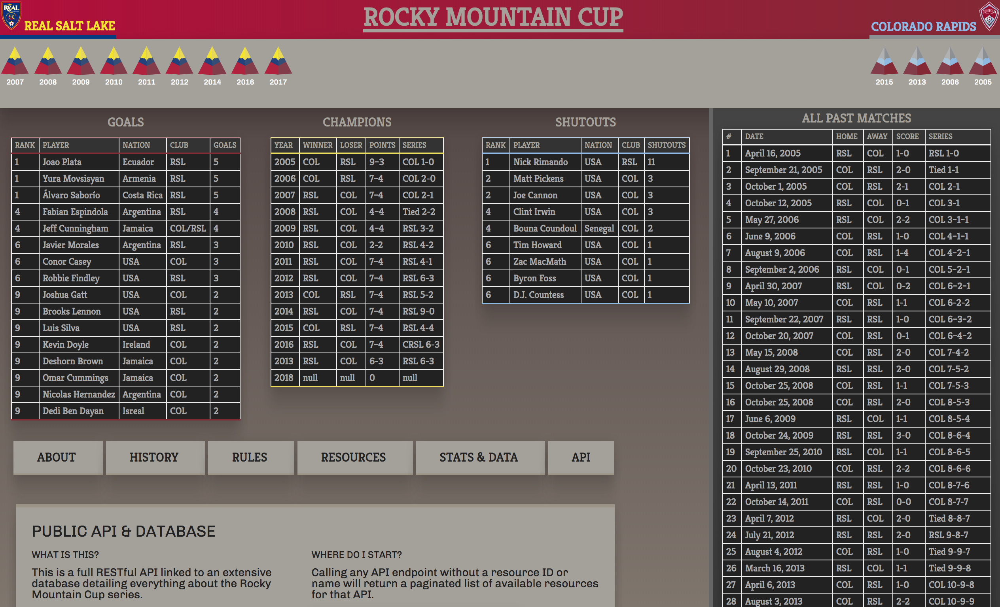

# Rocky Mountain Cup | Public API & Database

### Author **Ben Casalino**
### Contact **BenCasalino@gmail.com**

## Description
This website is not affiliated with the MLS in anyway, merely a place to keep track of stats from the Rocky Mountain Cup.

## Setup
In a web browser navigate to _https://rockymountaincup.firebaseapp.com/_ to view
## App Layout

- Link to: [Deployed front-end URL](https://rockymountaincup.firebaseapp.com/)
- Link to: [Code Frontend Repo](https://github.com/bencasalino/rmcup)

# Legal
Copyright (c) 2018 **_Benjamin M. Casalino_**

This software is licensed under the MIT license.

Permission is hereby granted, free of charge, to any person obtaining a copy
of this software and associated documentation files (the "Software"), to deal
in the Software without restriction, including without limitation the rights
to use, copy, modify, merge, publish, distribute, sublicense, and/or sell
copies of the Software, and to permit persons to whom the Software is
furnished to do so, subject to the following conditions:

The above copyright notice and this permission notice shall be included in
all copies or substantial portions of the Software.

THE SOFTWARE IS PROVIDED "AS IS", WITHOUT WARRANTY OF ANY KIND, EXPRESS OR
IMPLIED, INCLUDING BUT NOT LIMITED TO THE WARRANTIES OF MERCHANTABILITY,
FITNESS FOR A PARTICULAR PURPOSE AND NONINFRINGEMENT. IN NO EVENT SHALL THE
AUTHORS OR COPYRIGHT HOLDERS BE LIABLE FOR ANY CLAIM, DAMAGES OR OTHER
LIABILITY, WHETHER IN AN ACTION OF CONTRACT, TORT OR OTHERWISE, ARISING FROM,
OUT OF OR IN CONNECTION WITH THE SOFTWARE OR THE USE OR OTHER DEALINGS IN
THE SOFTWARE.

##Style Guide
Pallet:
#4D3F3F #4E443D #9B9487 #9A9386 #E3DFDB #E2DEDA #AD424D #AE3F4A #A4A19B #9FB8D4 #9EBDDD #E5DD5F #ECDD51

RSL CLARET RED HEX COLOR: #B30838; RGB: (179, 8, 56) COBALT BLUE  HEX COLOR: #013A81;  RGB: (1, 58, 129) REAL GOLD  HEX COLOR: #F5E700;  RGB: (245, 231, 0)

COR BURGUNDY PANTONE: 202 HEX COLOR: #862633; RGB: (134, 38, 51) CMYK: (9,100,64,48) SKY BLUE PANTONE: 278 HEX COLOR: #8BB8E8; RGB: (139, 184, 232) CMYK: (45,14,0,0) SILVER HEX COLOR: #8D9093; RGB: (141,144,147)